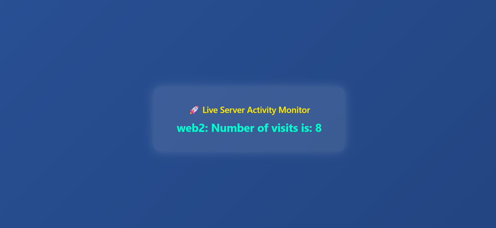

# 🚀 NGINX + Node.js + Redis - Load Balanced Web App

A simple, modern web application demonstrating container orchestration using **Docker Compose**, with:

- 🔁 Load balancing via **NGINX**
- ⚡ Fast server-side logic via **Node.js**
- 📊 Shared counter using **Redis**
- 🎨 Beautiful responsive frontend with glowing stats per server

> Every time you refresh the page, the visit count increases and shows which backend server (`web1` or `web2`) responded — all behind a reverse proxy!

---
## 📸 Preview



---

## 🧱 Tech Stack

| Layer         | Tool        |
|---------------|-------------|
| Reverse Proxy | NGINX       |
| Backend       | Node.js     |
| Data Store    | Redis       |
| Container     | Docker + Compose |
| UI            | Custom HTML/CSS Neon Theme |

---

YAML
## 🚀 How to Run

### ✅ Option 1: Local (Linux/Mac/WSL)

```bash
git clone https://github.com/your-username/nginx-nodejs-redis.git
cd nginx-nodejs-redis
docker compose up --build

Refresh page → watch counter increase and server hostname change
